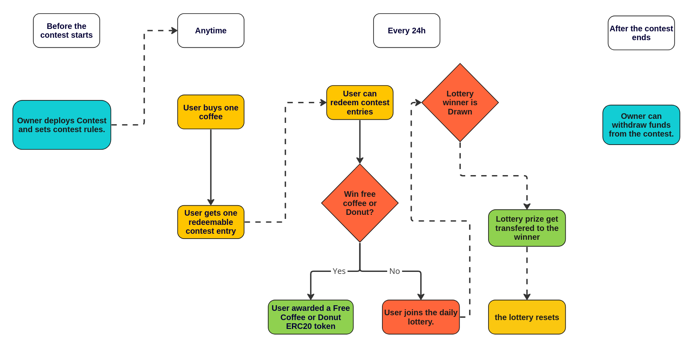

# Decentralized Fair Contest System for a Coffee Chain

## Overview
This project is a provably fair contest system designed for coffee chains. It draws inspiration from the very popular 'Roll Up the Rim' contest run annually by the Canadian coffee chain, Tim Horton's.

The system functions in a way similar to a raffle. Each coffee purchase made with Ether grants customers a contest participation that can be redeemed at their convenience. When a participation is redeemed, there's a 1 in 10 chance to secure a free coffee or a donut, awarded as ERC20 Tokens. However, if the participation does not result in an instant win, it enters a daily lottery. The prize for this lottery is an appealing 5% of the total value of coffees purchased over the previous 24 hours. After a span of 30 days, the contest comes to a close and any unredeemed participations expire.

## Motivation

The motivation behind this project originated from an incident in March 2023 during the annual 'Roll Up the Rim' contest by Tim Horton's. The contest had moved completely online since 2020 and, unfortunately, suffered from an alleged bug that resulted in an inordinate number of winners for prepaid credit cards. Rather than receiving their due rewards, these winners were handed a gift card and an apology email. While seemingly minor, this incident emphasized a pressing issue: the challenge of trusting large corporations to uphold fairness and honesty in their contests, especially in a rapidly evolving digital world. Similar issues have been observed with other well-known entities, including the Robinhood trading app and the McDonald's Monopoly contest.

With this project, I aim to create a contest system that is undeniably fair and honest. Every contest draw can be traced back, every prize is securely locked within a contract, and even the contest contract owner cannot alter the rules midway through the contest. This project embodies my commitment to restoring trust in contests and ensuring a transparent playing field for all participants.

## Technologies Used

### Development and deployment
- [Solidity](https://docs.soliditylang.org/en/v0.8.21/) is used as scripting language.
- [Foundry](https://github.com/foundry-rs/foundry) is used as *Solidity framework*.
- OpenZeppelin's [ERC20](https://docs.openzeppelin.com/contracts/4.x/erc20) contracts are used for the tokens.
- OpenZeppelin's [Ownable](https://docs.openzeppelin.com/contracts/2.x/access-control) contract is used for access control.
- The [Foundry-devops](https://github.com/Cyfrin/foundry-devops) library is used for streamlining deployment in test environments.

### Core features
- A Chainlink [Decentralized Datafeeds](https://data.chain.link/) is used to get the latest *eth/usd conversion rate*. 
- Chainlink [Verifiable Random Functions](https://chain.link/vrf) are used to get a source of randomness. This is used for the instant prizes and the lottery draw.
- Chainlink [Automation](https://chain.link/automation) is used to automate the time-based actions such as picking a daily lottery winner and closing the contest after 30 days.

### testing
- [Foundry](https://github.com/foundry-rs/foundry) is used for the unit tests.
- [Slither](https://github.com/crytic/slither) is used as static analyser.
- [Echidna](https://github.com/crytic/echidna) is used for Fuzz testing.

## Main features

### Flow chart of the system


## Setup and Installation
```
git clone https://github.com/alexlangev/fair-coffee-contest-smart-contracts
cd fair-coffee-contest-smart-contracts
forge build
```

## Usage

### Testing

```
forge test
```

To see the test coverage,

```
forge coverage
```

## Future improvements/Features

The project is still under development. Here is my current ToDo list to achieve a M.V.P. 

- Write an intergration test suite with foundry.
- Write a fuzz testing suite with echidna.
- Add support for testing of a forked Sepolia testnet.
- Add withdrawing mechanism for the contest owner.
- Add a burning mechanism that let's users spend their free coffee and free donuts tokens.

The following are bigger modifications for a potential V2.

- Build a minimal front-end and publish on Sepolia.
- Replace the Ether lottery prizes with a stablecoin prize. This way, the lottery prize is constant throughout the contest.
- Optimize for gas efficiency.

## License

It's MIT, do what you want with it!